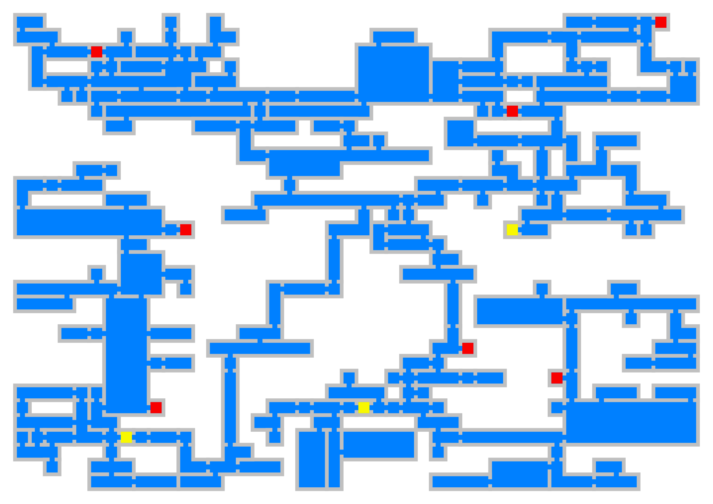

# Map Generator



Map Generator is a Rust-based project designed to generate and serve maps. It is composed of five main components:

1. **generator-core**: Contains the core logic and algorithms for map generation.
2. **generator-cli**: A command-line interface for interacting with the map generator.
3. **generator-ui**: A Slint based desktop app, to generate, view and save maps.
4. **generator-server**: A server that exposes APIs for map generation and management.
5. **generator-lambda**: An AWS Lambda function for serverless map generation.

## Features
- Modular architecture with separate concerns for core logic, CLI, server and UI.
- Uses `rayon` for parallel processing at the algorithm core
- Built using `slint` for the UI desktop app.
- Built using `axum` for the server side.
- Extensible design for adding custom algorithms and services.

## Getting Started

### Prerequisites
- Rust (latest stable version)
- Cargo (Rust package manager)

Use [rustup](https://rustup.rs/) to easily install and manage both.

### Building the Project
To build the project, run the following command in the root directory:
```bash
cargo build
```

### Running the CLI
Use this command to run the CLI and get details about it's possible arguments:
```bash
cargo run --bin generator-cli -- --help
```

### Running the UI
Use this command to run the Desktio app:
```bash
cargo run --bin generator-ui
```

### Running the Server

#### Environment Configuration
The server configuration is loaded from environment variables. Ensure the following variables are set:
- `SERVER_PORT`: The port on which the server will run.

To start the server run:
```bash
cargo run --bin generator-server
```

The server will start and listen on the port specified in the environment configuration.

#### Example query:
```bash
# Example requesting a 46 by 32 map with Castlevania-SOTN style:
curl --header "Content-Type: application/json" --request "POST" --data '{"columns": 46, "rows": 32, "style": "castlevania-sotn"}' http://localhost:5432/api/map

# Server response
{"status_code":201,"data":{"id":"90b412e4-3db3-439e-94ad-fdba7c4cfb67"}}
```

### Deploying to AWS Lambda
For details on how to use cargo lambda, take a look [here](https://www.cargo-lambda.info/). For details about AWS CLI, read the [guide](https://docs.aws.amazon.com/cli/latest/userguide/cli-chap-getting-started.html).

Having both AWS configured and `cargo lambda` installed, use thise commands below to build and deploy the lambda:

```bash
# Build the Lambda function
cargo lambda build --release --arm64 --manifest-path generator-lambda/Cargo.toml

# Deploy the Lambda function (requires AWS credentials)
cargo lambda deploy --manifest-path generator-lambda/Cargo.toml map-generator
```
### Testing
To run tests for the project, execute:
```bash
cargo test
```

## Project Structure
```
map-generator/
├── generated/            # Generated map files
├── generator-cli/        # Command-line interface
├── generator-core/       # Core logic and algorithms
├── generator-lambda/     # AWS Lambda function handler
├── generator-server/     # Server exposing APIs
├── generator-ui/         # Slint app
└── target/               # Build artifacts
```

## License
This project is licensed under the MIT License. See the `LICENSE` file for details.
